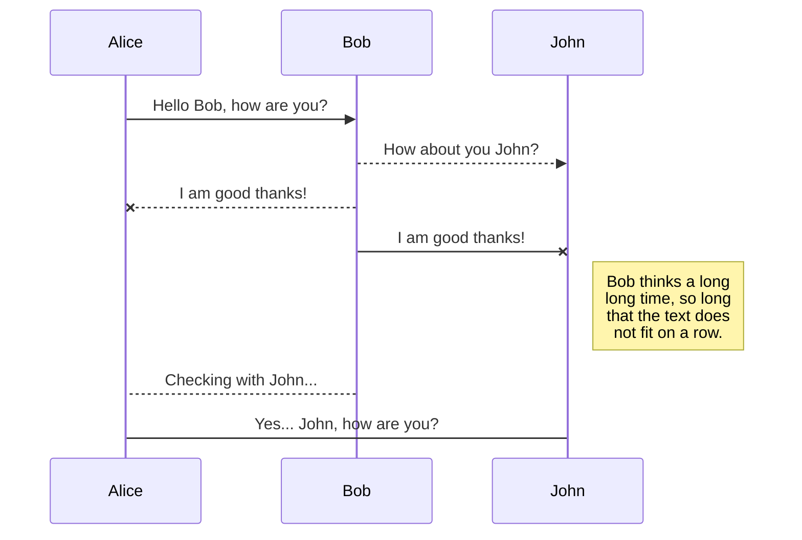
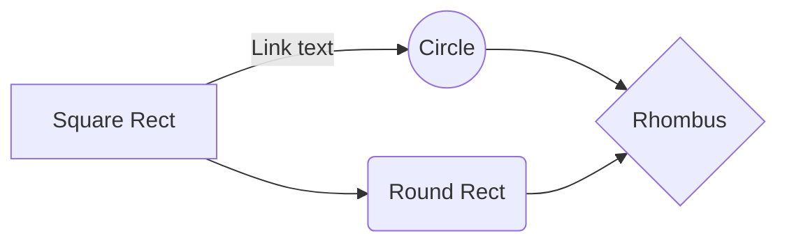

# ME5406 Project 2: Deep Learning for Industrial Fixed Robotic Manipulator

This package contains four 'main' files which can be used to launch different variants of DQN neural networks for the custom OpenAI Gym environment created for an Industrial Fixed Robotic Manipulator.
Author(s): Arjun Agrawal, Ritwik Jha

## System Requirements
The following are the libraries needed to run this project. The project is written in python 3.6.9. 

>torch=1.7.0
matplotlib=3.3.3
numpy=1.19.4
gym=0.17.3

## Neural Networks Used

| S/No. | Algorithm | Experience | Epsilon | Height Heuristic |

|-------|-----------|------------|---------|------------------|

| 1 | DDQN  | Yes  | Fixed | No |

| 2 | DQN | No | Decaying | Yes  |

| 3 | DQN | Yes  | Decaying | Yes  |

| 4 | DDQN  | No | Decaying | Yes  |

| 5 | DDQN  | Yes  | Decaying | Yes  |

## Files

### main_DQN.py

Launches the DQN neural network with experience replay

### main_DQNnx.py

Launches the DQN neural network without experience replay

### main_DDQN.py

Launches the DDQN neural network with experience replay

### main_DDQNnx.py

Launches the DDQN neural network without experience replay

### factory_env.py

The factory_env.py file runs the environment created for this project. It creates the OpenAI Gym needed for the neural network to train in. The script categories actions taken by the agent into classes and calculates the rewards for a given time step. Along with this it also calculates the new state of the agent in the environment.

### Env_Visualisation.py

This script is used to render the conveyer belt and the robotic manipulator with a 3D-scatter plot. We decided against the use of an open-source physics engine or a simulator to give ourselves better control of the environment and aid our understanding of the topic.

## Training the model

Here we exemplify the use of the DDQN variation of the neural network. Please change `main_DDQN.py` to one of the four main files mentioned above for exploration.

Open up `main_DDQN.py` for editing. In this script the following parameters can be defined:

>number of episodes = `EPISODES`
batch size = `BATCH_SIZE`
memory = `MAX_MEM`
probability of skittle generation = `PROB`
directory = `PATH` 

Once you have set the variables to your liking, run the code via

>`python3 main_DDQN.py`

## Demonstration

Two visulisations were explored in this project an isometric view which visualised both the movements of the arm and the conveyer belt, and another which provided a clearer top down view of the conveyer belt. When trained to completion the randomly generated lines of skittles will be cleaned up into 7 lines of skittles organised by color.

>Note: the 3D rendering is helpful in understanding how the arm interacts with the belt but it warps the aspects ratio of the belt. The 2D top down view is best suited for gaining a true perspective on the relative distances between skittles and the size of the skittles relative to the belt.

## KaTeX

You can render LaTeX mathematical expressions using [KaTeX](https://khan.github.io/KaTeX/):

The *Gamma function* satisfying $\Gamma(n) = (n-1)!\quad\forall n\in\mathbb N$ is via the Euler integral

$$
\Gamma(z) = \int_0^\infty t^{z-1}e^{-t}dt\,.
$$

> You can find more information about **LaTeX** mathematical expressions [here](http://meta.math.stackexchange.com/questions/5020/mathjax-basic-tutorial-and-quick-reference).

## UML diagrams

You can render UML diagrams using [Mermaid](https://mermaidjs.github.io/). For example, this will produce a sequence diagram:

And this will produce a flow chart:

